# WILSON — Systems Design Pack

**v1.0.0 · 2026-07-30 · diagrams only.**

Source pack for the visual design session. Every diagram is engineering-honest
(real route, table and function names). **All explanation lives in
`SYSTEMS_HANDBOOK.md`** — the section link under each diagram is where to go.

---

## Inventory

| ID | Shows | Handbook |
|---|---|---|
| **D1** | Every system and every connection between them | §2, §14 |
| **D2** | The three Supabase environments and which client hits which | §4.1 |
| **D3** | Trust boundaries — where authorization actually happens | §4.4 |
| **W1** | Desktop app screen layout | §13.4 |
| **W2** | Web + operator console screen layouts | §3.2, §5.1 |
| **W3** | D.O.G. screen | §13.1 |
| **W4** | O.T.T.E.R. screen | §13.2 |
| **W5** | R.A.B.B.I.T. screen | §13.3 |
| **W6** | Admin Terminal screen | §13.4 |
| **W7** | Operator console screen | §5.6 |
| **T1** | D.O.G. brief → outline → exports | §13.1 |
| **T2** | O.T.T.E.R. generate → study → quiz → validate | §13.2 |
| **T3** | R.A.B.B.I.T. intake → breakdown → views | §13.3 |
| **F1** | Login: resolve → password → MFA → workspace → session | §4.2 |
| **F2** | Invite → onboarding | §4.6, §9 |
| **F3** | Realtime broadcast + merge | §4.5 |
| **F4** | Soft delete → trash → restore → purge → GC certificate | §12.3, §12.4 |
| **F5** | Storage relink: scan → match → preview → apply | §12.2 |
| **F6** | ai-proxy call path | §6 |
| **F7** | Change request: submit → review → apply | §13.2 |
| **F8** | CSV exports + workspace takeout | §12.5 |
| **F9** | Workspace provision + teardown | §5.4 |
| **F10** | Auto-update + nightly backups | §7.2, §11 |
| **S1** | Change-request state machine | §13.2 |
| **S2** | Pet life cycle | §13.5 |

---

## D1 — System map

Every external system as a node; every arrow labelled with protocol and payload.

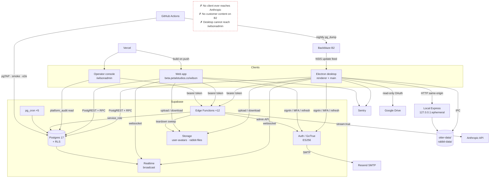

- Arrows into Postgres from clients are **direct** — RLS is the boundary, not a middle tier.
- Edge Functions run as `service_role` (RLS bypassed), so each re-checks a live row itself.

→ Handbook §2, §14

---

## D2 — Environments

Which client talks to which Supabase project.

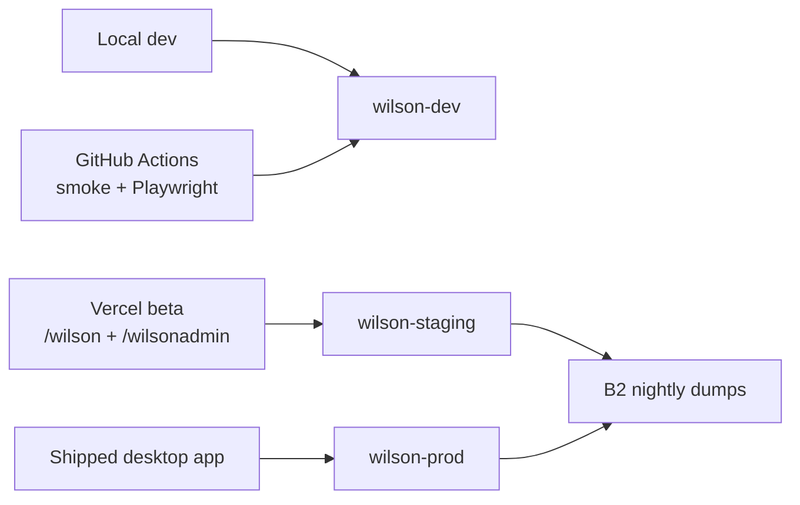

- Migrations 0000–0029 and all 12 Edge Functions are deployed to all three.
- CI's pgTAP job uses a **throwaway local stack**, not any of these.

→ Handbook §4.1

---

## D3 — Trust boundaries

Where authorization actually happens.

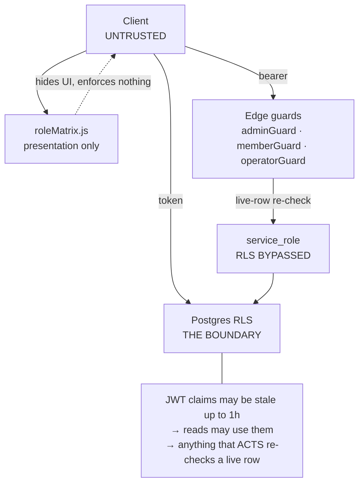

- `roleMatrix.js` mirrors SQL helpers for UI only; **lockstep is a hard invariant**.
- `operatorGuard` fails **closed**; the rate limiter fails **open**. Both deliberate.

→ Handbook §4.4, §4.6

---

## W1 — Desktop shell

Every page mounted at once; `display` toggles one visible.

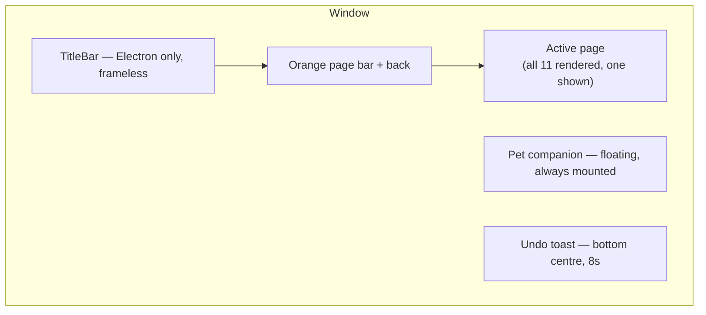

- Pages: `home · dog · otter · rabbit · dashboard · project-manager · rate-card · team-members · admin-terminal · settings · help`.
- Consequence: every page's effects and hooks run everywhere — gate on `currentPage`.

→ Handbook §13.4

---

## W2 — Web and operator surfaces

Two separate build targets on one origin.

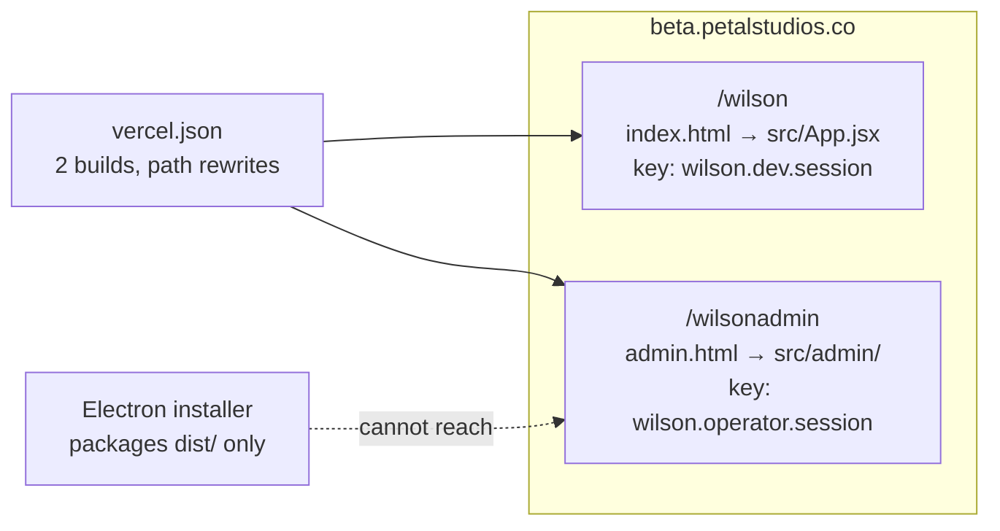

- `vite --mode admin` gates `rollupOptions.input` — that gate is what keeps the console out of the installer.
- localStorage is per-**origin**: the differing key string is the *entire* isolation mechanism.

→ Handbook §3.2, §5.1, §5.2

---

## W3 — D.O.G. screen

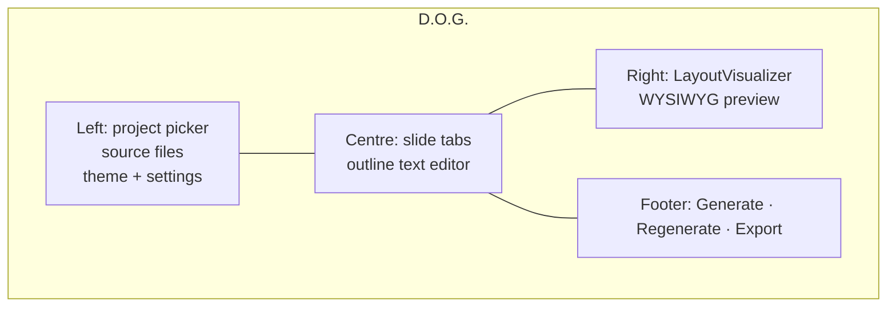

→ Handbook §13.1

---

## W4 — O.T.T.E.R. screen

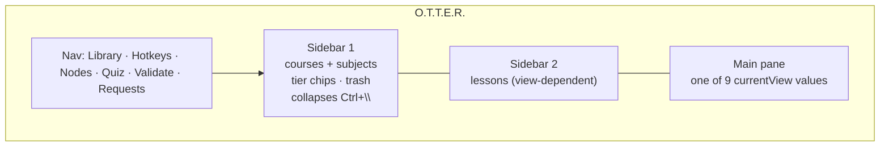

- Views: `library · prompt · study · quiz · hotkeys · nodes · sources · requests · validator`.
- `requests` and `validator` are conditionally **mounted**, not just hidden.

→ Handbook §13.2

---

## W5 — R.A.B.B.I.T. screen

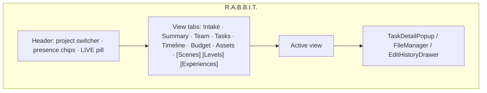

- Bracketed tabs appear only when the project enables that module.

→ Handbook §13.3

---

## W6 — Admin Terminal

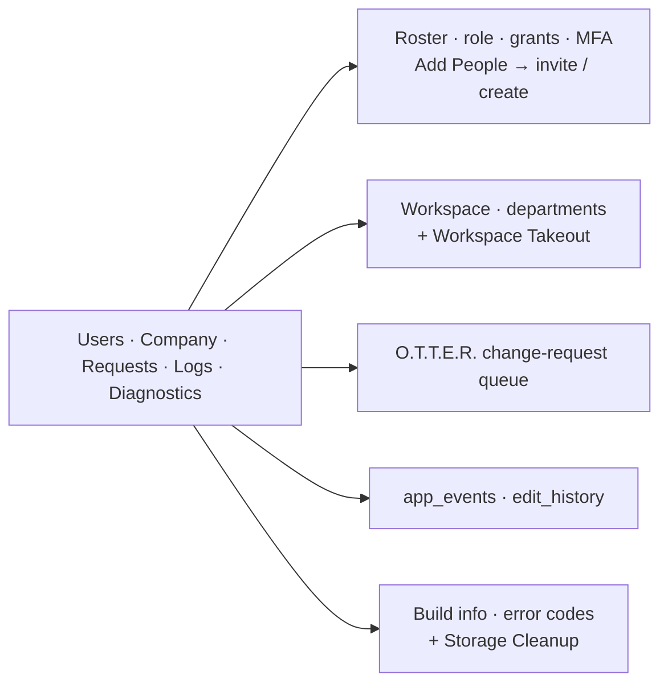

- Each section lazy-fetches on first activation (`isActive`), never at page mount.

→ Handbook §13.4

---

## W7 — Operator console

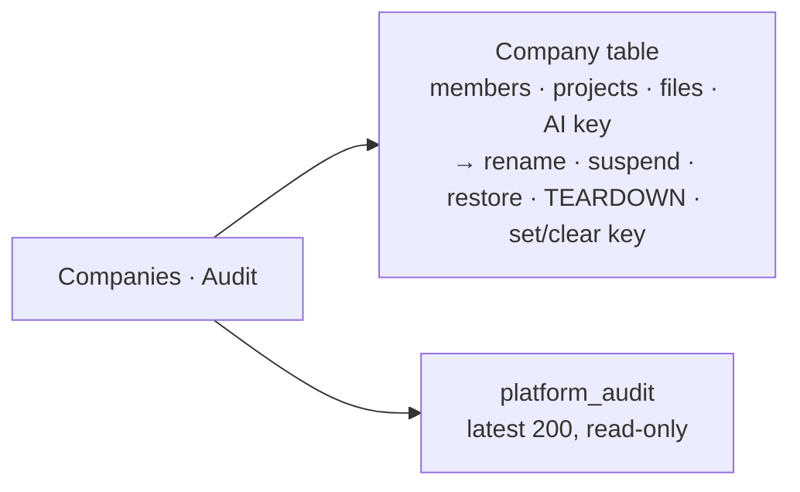

- No router, no tools, no pet. Sign-in is email + password + TOTP.

→ Handbook §5.6

---

## T1 — D.O.G. dataflow

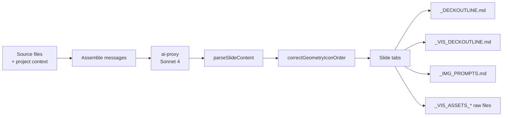

- Full-deck generation loops up to 3 **continuations** on `stop_reason: max_tokens`.
- COMPONENT GEOMETRY JSON is exported for an external Slides extension — nothing in-app renders it.

→ Handbook §13.1

---

## T2 — O.T.T.E.R. dataflow

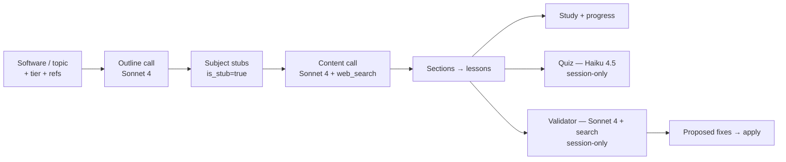

- Quiz scores and Validator findings are **not persisted**.

→ Handbook §13.2

---

## T3 — R.A.B.B.I.T. dataflow

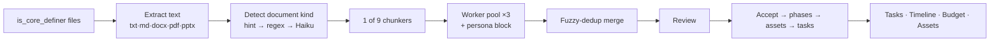

- Partial chunk failure is tolerated; **all** chunks failing throws loudly.

→ Handbook §13.3

---

## F1 — Login

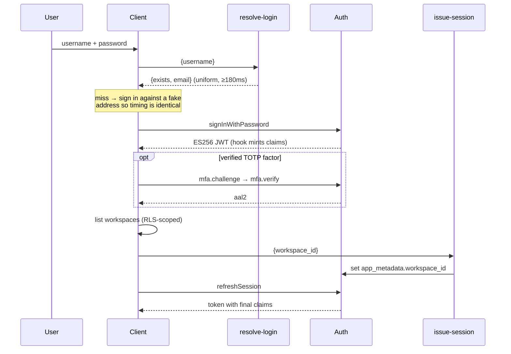

→ Handbook §4.2

---

## F2 — Invite and onboarding

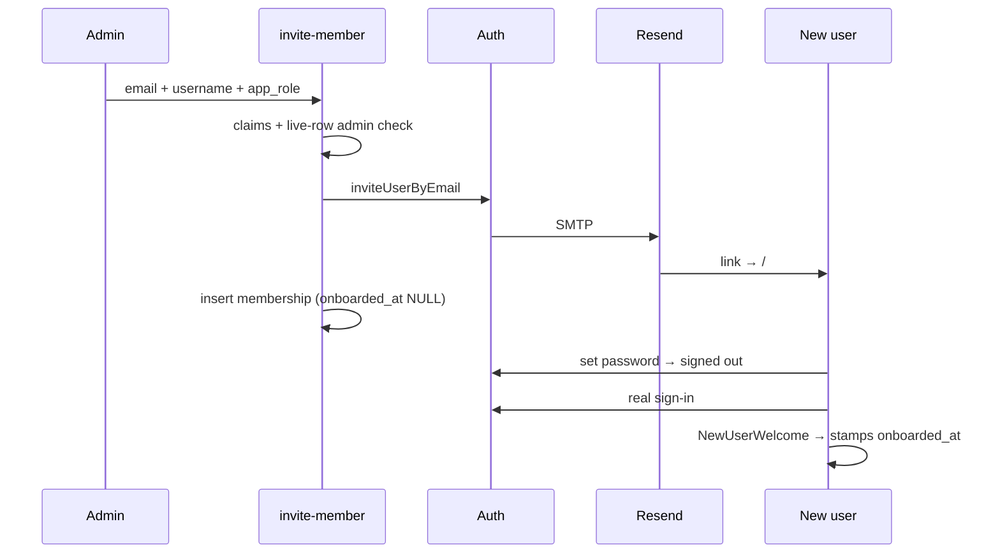

→ Handbook §4.6, §9

---

## F3 — Realtime

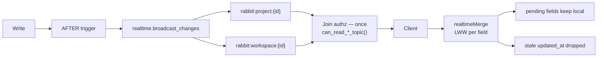

- **Not** `postgres_changes`: it re-checks the NEW row per event, so soft-delete events would be withheld.

→ Handbook §4.5

---

## F4 — Delete lifecycle

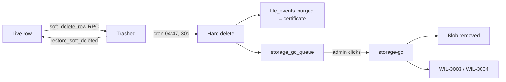

- GC is admin-invoked, never cron: the click is TPN's second authorization factor.
- `purged` rows have no FKs, so the certificate outlives its subject.

→ Handbook §12.3, §12.4

---

## F5 — Storage relink

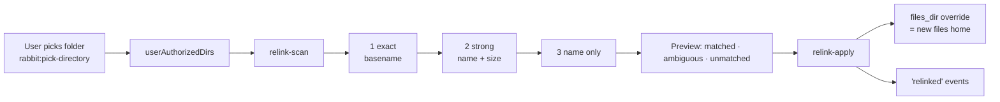

- 403 for any folder not picked through the dialog; 409 if the recorded home is merely offline, or if the change would strand a file.

→ Handbook §12.2

---

## F6 — ai-proxy

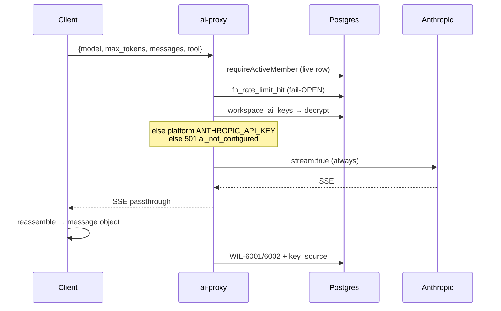

- Always streams: the 150 s Edge response deadline would kill long generations.
- An SSE `error` event closes the stream *normally* — both sides sniff for it.

→ Handbook §6

---

## F7 — Change request

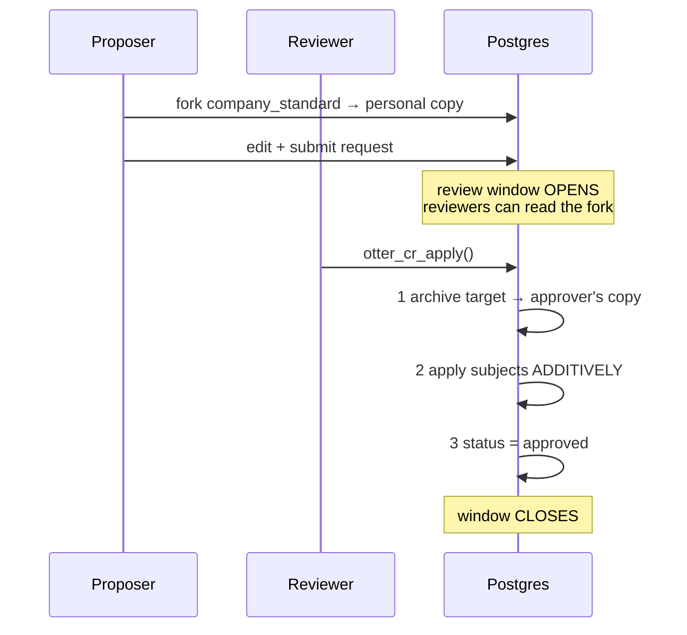

- Approving **applies**; a bare status flip raises.
- Additive only — update by slug, insert when absent, never delete. Reference docs untouched.

→ Handbook §13.2

---

## F8 — Export and takeout

```mermaid
flowchart LR
  V["Page view"] -->|"exactly what you see"| CSV["roster / rate-card / tasks CSV"]
  AD["Admin"] --> TK["Workspace Takeout"]
  TK --> RD["Admin's own RLS-scoped reads<br/>19 tables, paged"]
  RD --> ZIP["zip + manifest.json"]
  EX["EXCLUDED: O.T.T.E.R. · Notes<br/>· gc queue · blobs"] --- TK
```

- Never a DEFINER sweep — a takeout can only contain what that admin already reads.
- `csvExport.js` guards: BOM, RFC 4180, formula-injection prefix on `= + @ -`.

→ Handbook §12.5

---

## F9 — Workspace provision and teardown

```mermaid
flowchart TB
  subgraph Provision
    P1["create auth user"] --> P2["provision_workspace_and_admin"] --> P3["seed workspace_id"] --> P4["WIL-7001 certificate"]
  end
  subgraph "Teardown — the ORDER is the design"
    T1["1 snapshot slug + name"] --> T2["2 require typed slug"]
    T2 --> T3["3 collect blob paths<br/>files + gc_queue, .range() paged"]
    T3 --> T3a["3b list avatars by prefix<br/>user-avatars/{ws}/…"]
    T3a --> T3b["3c sweep OPEN upload reservations<br/>sweep_open_uploads → abandoned paths"]
    T3b --> T3c["3d WIL-7012 certificate ×40<br/>before any blob moves"]
    T3c --> T4["4 refuse foreign paths → WIL-7008"]
    T4 --> T5["5 delete blobs ×100<br/>certificate ×40 → WIL-7006"]
    T5 --> T5a["6b delete avatars ×100<br/>certificate ×40 → WIL-7006"]
    T5a --> T6["7 DELETE workspace → CASCADE"]
    T6 --> T7["8 drop queue rows AFTER cascade"]
    T7 --> T8["9 WIL-7005 certificate"]
  end
```

- Collect **before** the cascade: afterwards nothing can tell which blobs were the tenant's.
- Queue rows are dropped **after**, because the cascade re-enqueues them.
- **Three buckets, not two** (Track C / C2): `user-avatars` is *listed* by
  prefix rather than derived from rows, because no row names an avatar object.
- The reservation sweep and its certificate come **first**, before any blob is
  touched: the sweep commits its rows immediately, and `file_events` is
  destroyed by the cascade a moment later.

→ Handbook §5.4

---

## F10 — Update and backup

```mermaid
flowchart LR
  subgraph "Auto-update"
    LI["Sign-in"] --> CK["checkForUpdates"]
    CK --> OF{"available and<br/>not skipped?"}
    OF -->|yes| PR["UpdatePrompt"]
    PR --> DL["download → Restart & install"]
    PR --> SK["Skip → localStorage"]
    B2A["B2 generic feed"] --> CK
  end
  subgraph "Backups"
    CR["cron 08:15 UTC<br/>on main branch only"] --> PD["pg_dump prod + staging"]
    PD --> UP["B2, 90d, Object Lock"]
    UP --> VF["re-list or fail"]
  end
```

- A `schedule` workflow only fires from the **default branch** — otherwise it is decoration.
- NSIS is the only auto-updatable artifact; Forge/Squirrel degrades to `unsupported`.

→ Handbook §7.2, §11

---

## S1 — Change-request states

```mermaid
stateDiagram-v2
  [*] --> open: submit
  open --> approved: otter_cr_apply() ONLY
  open --> rejected: decline
  open --> changes_requested: decline + note (required)
  open --> withdrawn: proposer
  changes_requested --> open: resubmit (revision+1)
  changes_requested --> rejected: accept decision
  approved --> [*]
  rejected --> [*]
  withdrawn --> [*]
```

→ Handbook §13.2

---

## S2 — Pet life cycle

```mermaid
stateDiagram-v2
  [*] --> egg
  egg --> baby: hatch
  baby --> adult: evolve
  adult --> sleeping: 15 interactions / 30 min
  sleeping --> adult: wake
  adult --> corpse: hunger ≤ 0
  corpse --> ghost: 10s
  ghost --> egg: new egg
```

- Two independent 30 s intervals: decay, and auto-save.

→ Handbook §13.5
