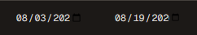
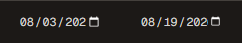
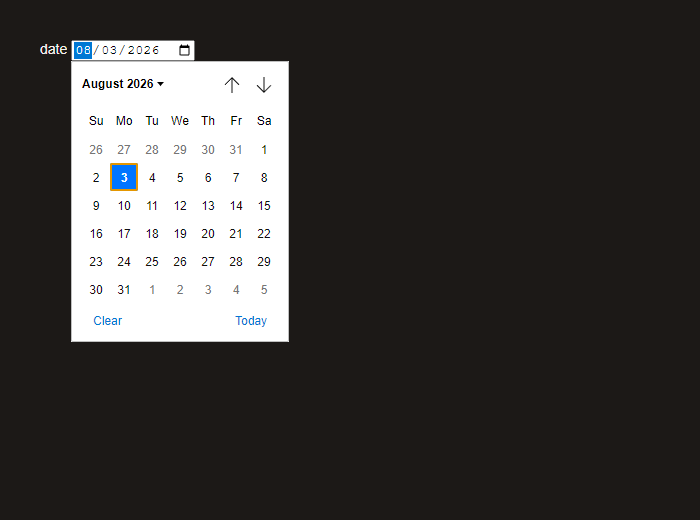
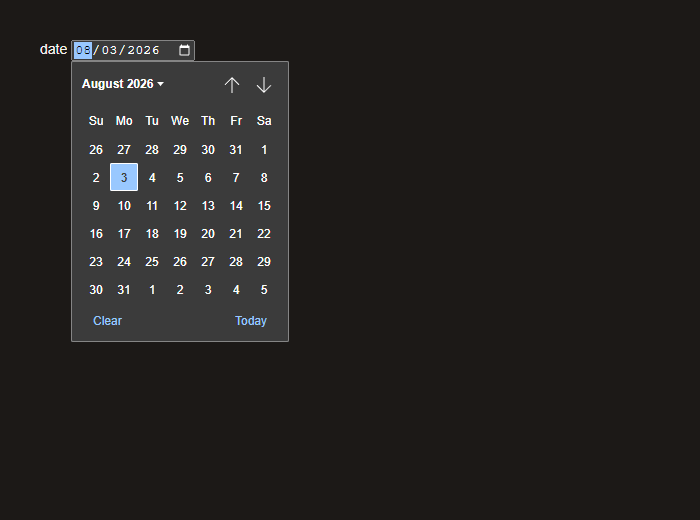
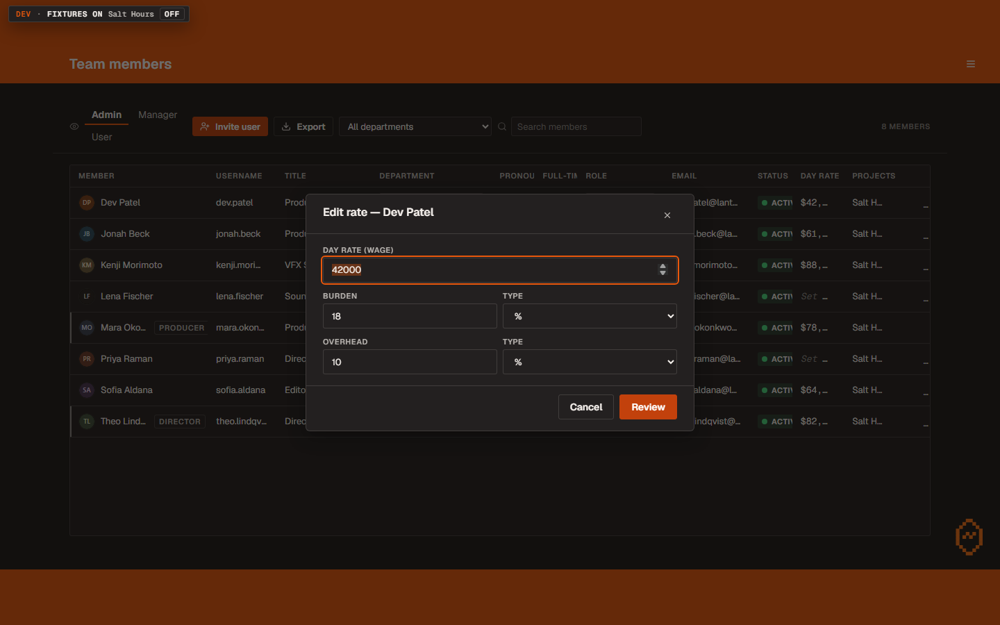
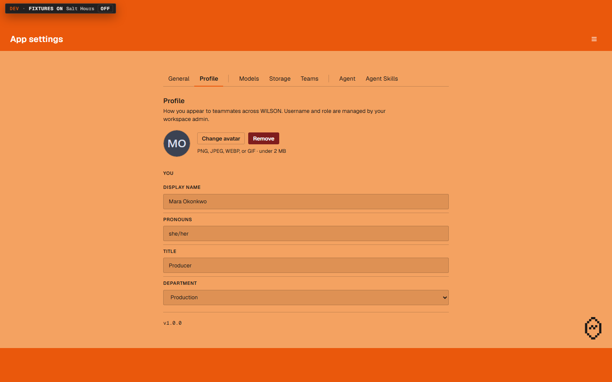

# 28 — The kit requests (UI overhaul, Foundation session F3)

Nothing on this list is a new screen. Four sessions that have already finished
— App settings, the sign-in family, Resources, the Dashboard — each hit
something the shared component kit could not do, wrote it down instead of
hand-rolling it, and moved on. This session went through all twenty-six of
those notes and fixed the ones that are defects.

Three of them were holding up every page that has not been done yet, so they
had to land before those pages start.

Branch `ui/f3-kit-requests`, integrated into `feat/ui-overhaul`.

---

## The three that mattered

### 1. Date pickers were opening white

Open **R.A.B.B.I.T. → a project → Assets** and click the little calendar in a
Start or Due cell.

WILSON never told the browser it was a dark application. There is one CSS
property for that, `color-scheme`, and it appeared nowhere in the code. So
every control the browser draws for itself — the calendar behind a date field,
the up/down arrows on a number field, the list a dropdown opens, the
scrollbars we have not styled — was drawn in the browser's light theme. On the
dark pages that means a near-white panel opening on top of a near-black page.
That is the one thing you asked for in capitals, arriving through the
browser's own stylesheet instead of through ours.

Two pages had already patched it for themselves. It is now one rule in one
place, so every page gets it, including the dozen date fields in R.A.B.B.I.T.
that were still waiting.

**The field's own calendar icon, before and after** — same cells, same page:

| before | after |
|---|---|
|  |  |

Before, the icon is a dark block on a dark field. After, it is a light
calendar you can actually see.

**The panel itself, before and after:**

| before | after |
|---|---|
|  |  |

One honest note about those two. They were taken from the desktop runtime
rather than from the app, and here is why. The panel is drawn by the browser
outside the page, and whether it goes dark depends on the machine's own
Windows theme as well as on our rule. **Your machine is in dark mode, so you
would have seen a dark panel either way.** On a light-mode machine — a new
laptop, a colleague's, a demo room — the panel was the near-white one on the
left. The pair above is that machine, before and after our rule, and the rule
alone is what turns it dark. Nothing about the app's own colours changed.

### 2. Dialogs had no keyboard

This one is quiet and it matters more than it sounds.

Open **RESOURCES → Team members**, hover a row, and click the little rate icon
in the Day rate column. That dialog announces itself to a screen reader as a
modal, and until now none of the three things a modal promises was true: it
did not take the keyboard when it opened, the Tab key walked straight out of
it and into the page behind the dark backdrop, and closing it dropped the
keyboard on the floor.

It matters now because of the change you approved in walkthrough 22: the four
native "Are you sure?" pop-ups in App settings become proper dialogs, and
there are twenty-seven of those pop-ups across the app. The native one is a
real modal. Every conversion would have traded a working keyboard for a broken
one.

**Try it without touching the mouse.** Tab until the rate icon on a row has
the orange ring, press Enter, and then:

1. The caret should already be in **Day rate**.
2. Hold Tab down through the fields and the two buttons at the bottom. After
   the last one the ring should jump to the **X** at the top right, and then
   back round into **Day rate** — it should never leave the panel and land on
   something in the table behind it.
3. Shift+Tab should go round the same loop backwards.
4. Type a different number, press **Escape** once: the number goes back to
   what it was and the dialog stays open.
5. Press **Escape** again: the dialog closes and the orange ring is back on
   the rate icon you started from.

Step 4 is the rule you gave in walkthrough 21 — "Escape reverts the edit
first, closes on the second press". Step 5 is the part that was broken until
this session found it in the running app: focus was going to nowhere instead
of back to the button.

### 3. Escape stopped disappearing

A related and smaller one. When a page moved onto the shared text field, that
field quietly ate the Escape key, so anything else the page wanted Escape to
do stopped happening. Two places lost their way out that way and one of them
had no other exit. The field now reverts the edit **and** passes the key on.

---

## The rest, grouped

### Things that were invisible on the orange pages

The orange pages have exactly one ink, black, and several kit pieces were
still painting themselves in the dark-page colours there. Measured:

| what | was | now |
|---|---|---|
| a filter chip's label | 1.00 to 1 — invisible, not merely faint | 8.48 to 1 |
| a disabled icon button | 1.68 to 1 | 8.48 to 1 |
| a toggle switch's track, on and off | 1.68 and 1.73 to 1 | a black outline when off, a filled black track when on |
| a loading skeleton | lightened the ground by 1.05 to 1 | a visible grey block |
| a ghost button, the moment you hover it | 2.10 to 1 | 8.48 to 1 |
| a spinner | 1.05 and 1.73 to 1 | 8.48 to 1 |
| a keyboard key cap | a black chip floating on orange | the page's own warm well |

Most of these are not on a screen you use today, which is why nobody has
reported them — they are the pieces the *remaining* pages are about to be
built from. App settings has six toggles that are still plain buttons purely
because the switch did not work on that ground. The disabled icon button is
the exception: that one you could already meet on App settings, and it was
grey on orange when you did.

One thing I could not fix, and would rather tell you than hide: on these
pages a **disabled** icon button is now perfectly legible but still looks
much like an enabled one, because a bare glyph has no fill or edge to change
and there is only one ink. It says "not allowed" when you point at it. If
that bothers you, the fix is a design decision rather than a bug fix.

### Two buttons that were lying

On the orange pages, **a disabled button and an ordinary one were drawn
identically**, and so was a delete button. Same ink, same hairline, no fill on
any of them, because there is only one ink to work with. So the shape changes
instead:

- **Delete and Remove are now filled dark red with white text.** Three places
  on App settings show it today: **Remove** beside your avatar on Profile,
  **Sign out everywhere** on the same tab, and the **Disable MFA** confirm.
  It is the only colour in the whole system drawn on an orange page, and it
  is there because "are you sure you want to delete this" has to look
  different from "cancel".
  **It also turns up on the Dashboard's Profile tab**, which is a dark page,
  because that panel is shared with App settings and still believes it is on
  the orange one. The label reads fine there; the button's edge against the
  dark page does not, and the proper fix belongs with whoever next opens that
  panel. Worth a look, and worth saying rather than leaving you to find it.
- **A disabled button now sits in a recessed well with no edge** — it reads as
  a slot rather than a control.

Both are worth a look and both are one line to change if you dislike them.

That is **App settings -> Profile** as it looks now. Before this session
"Remove" and "Change avatar" were the same button drawn twice.

### Small ones you may notice

- **Buttons press.** Every button now dips two percent while your finger is
  down. Six sign-in buttons already did this; now they all do.
- **Buttons can show an icon.** Thirteen places in the code had already asked
  for one and silently got nothing.
- **A saving button says so properly** — it disables itself, shows a spinner
  in its own colour and swaps its label. The Team members rate dialog is the
  first one.
- **Error messages in a dialog footer wrap** instead of being cut off after
  about six words, which was the half that says what went wrong rather than
  the half that says what to do.
- **A disabled tab can explain itself** on hover. This is your Rate card
  complaint — "when i press internal i am not seeing the internal one" — given
  somewhere to put the answer.
- **The Rate card's average row is now a real table footer.** Same numbers,
  same place. A single average also stays put while the rates scroll under
  it; a card with two currencies in it has two averages, and those scroll
  with the rows, because pinning both would put them on top of each other.
- **Two form fields side by side line up.** On the Team members rate dialog
  the second of a pair sat 16px lower than the first. The Projects form had
  the same fault and had already been patched on that page; the kit now has
  the answer, so the patch can go when someone next opens it.

---

## What I did NOT do, and why

Five of the twenty-six are deferred, and none of them is a defect you would
see:

- **A one-time-code field** and **a dropdown that lives inside a table cell**
  are new components rather than fixes. Both need three or four finished pages
  to adopt them, which is a session of its own, not a side effect of this one.
- **The profile panel needs to know which page it is on.** It is mounted on
  both App settings and the Dashboard and currently assumes the orange one.
  The Dashboard has a working patch in place and the proper fix belongs with
  whoever next opens that panel. The two things its patch could *not* fix were
  kit faults and both are fixed above.
- **A permissions helper still greys out denied buttons with transparency**
  rather than the agreed colour, which puts a denied label at 2.20 to 1. It is
  not a kit file.

---

## What I could not check here

- **Everything above was verified in the browser, not in the packaged app.**
  The fake-studio data that made it checkable only exists in a development
  build, so the desktop app cannot show it. The one thing I would ask you to
  confirm from the real build is the dark date picker, on App settings and in
  R.A.B.B.I.T., at 125% and 150% Windows scaling.
- **The six App settings toggles are still buttons.** The switch works on that
  ground now, but converting them is that page's session, not this one.

---

## The one question for you

The filled dark red destructive button is the only status colour drawn on an
orange page anywhere in WILSON. The rule elsewhere is that the orange pages
carry no colour at all. I broke it in one place because an unreadable error
message is a worse outcome than an inconsistent one, and because the sign-in
screen has been using this exact red for a while already.

Keep it, or go back to an outlined button that looks like every other button?
