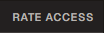
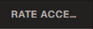
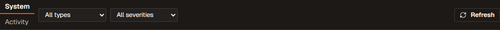
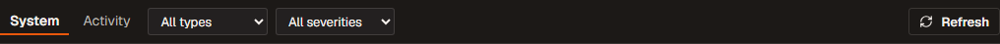
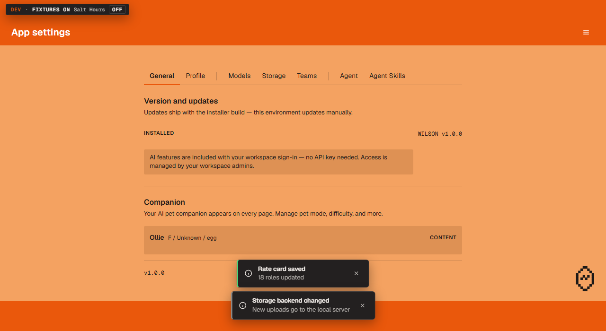
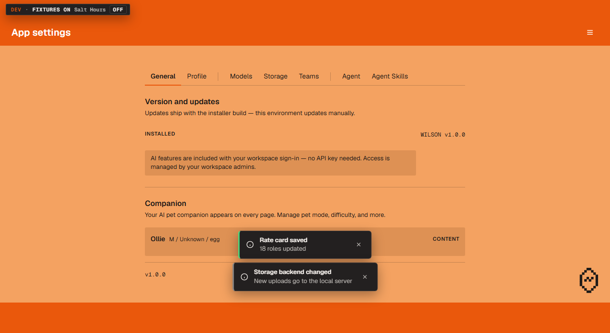
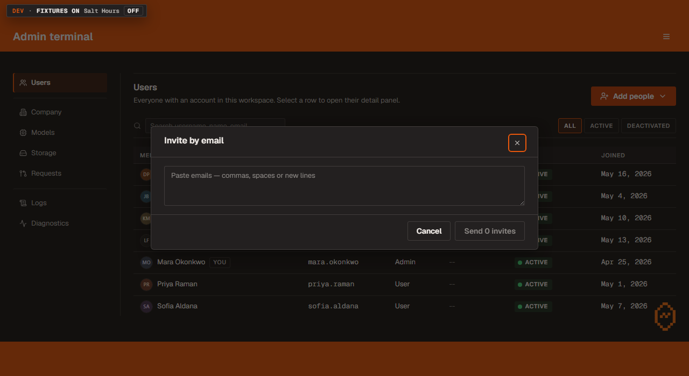

# 31 — The kit requests, part two (UI overhaul, Foundation session F4)

Walkthrough 28 went through twenty-six notes that four finished sessions had
left for the shared component kit. Three more sessions have finished since,
and they left nine more. This is those nine.

Same rule as last time: nothing here is a new screen, and nothing changes what
a click does. Every item is something a page hit, wrote down rather than
hand-rolling around, and moved on from.

Branch `ui/f4-kit-requests`, integrated into `feat/ui-overhaul`.

There are five things to look at, and they should take about five minutes. Every
"before" picture below is the real app with the old rule put back, so both
halves of each pair come from the same build and the same data.

---

## 1. A column header too narrow for its word

**Admin terminal → Users**, then make the window narrower until the `RATE
ACCESS` column runs out of room.

A header that does not fit used to be sheared off mid-word. There was no
ellipsis, so it did not read as "this column is narrow" — it read as something
broken. The stylesheet did ask for an ellipsis; it just had no effect, because
of what kind of box the word was sitting in.

| before | after |
|---|---|
|  |  |

It now trails off with `…`, which is the normal way a table says a column is
too narrow. Nothing about the column widths changed.

---

## 2. A two-tab strip breaking onto a second line

**Admin terminal → Logs.** Look at the row holding **System / Activity** and
the two dropdowns.

R.A.B.B.I.T.'s view switcher has eleven tabs and genuinely needs to wrap onto
a second line. That same permission was reaching every other tab strip in the
app, including two-tab strips sitting in a toolbar — where wrapping makes the
whole row 61 pixels tall instead of 44 and puts one tab under the other.

| before | after |
|---|---|
|  |  |

Two pages had already patched this for themselves. It is one rule in the kit
now, so it is fixed everywhere, and R.A.B.B.I.T.'s eleven tabs still wrap.

---

## 3. The small dropdowns had no room for their arrow

Same row as above — **All types** and **All severities**.

The small size of a field sets its padding in one shorthand, and that shorthand
was quietly cancelling the extra space a dropdown reserves for its arrow.
Measured: the space held back for the chevron was 8 pixels where it should have
been 28, so on the longest option the arrow sat almost on the last letter.

Look at the same before/after pair as item 2: in the "before" the arrow is
almost touching the word, and in the "after" there is a proper gap. This is the
smallest change on the list and the one most likely to be the reason a filter
row has always looked slightly cramped.

---

## 4. Two messages sitting on top of the orange bar

**App settings.** Do something that produces two notifications at once.

The notification stack was positioned 24 pixels up from the bottom of the
window. On a page with an orange bar along the bottom — which is most of them
— that is 24 pixels up from behind the bar. One message ended up inside the
bar. Two ended up straddling its edge, which is the picture on the left.

| before | after |
|---|---|
|  |  |

The stack now sits 24 pixels above the bar rather than above the window, and it
reads the bar's height from the same place the pet does — so when the bar
shrinks on a short screen, both move together. On App settings at this window
size the bar is 80 pixels and the stack now starts at 104.

**What to check:** that nothing ever appears over the orange, on any page, at
any window size.

---

## 5. The keyboard could walk out of a dialog

**Admin terminal → Users → Add people → Invite by email.** With that box open,
hold Shift and press Tab several times.

A dialog is supposed to hold the keyboard until you answer it. This one did
not: the focus ring walked straight out through the back of the box and onto
the page behind — the ALL / ACTIVE / DEACTIVATED buttons, the search field, the
Add people button — all while the box was still up and covering them. Pressing
Enter there would have run whichever control it had reached.

Measured on the real app with the fix removed: **eight Shift+Tabs, eight
escapes.** The very first press left the box.

With the fix, the same sixteen presses never leave it. Focus cycles Cancel →
the email field → the close X → Cancel, and the twenty-six controls behind the
box are unreachable until you close it.

The orange ring in that picture is on the close X, **inside** the box, after
sixteen presses.

**Two honest notes on this one.** First, the fix itself was already written by
the previous Foundation session; what this session did was find out whether it
actually worked, which nothing had checked. It does. Second, the case that was
originally reported was on App settings → Storage, but those controls only work
in the desktop app, so in a browser they are switched off and the keyboard
skips them anyway. Admin terminal has the same shape with live controls behind
it, so that is where it was measured.

---

## Also in this session, with nothing to look at

- The kit had a trap where a page could say "this row is NOT selected" in a way
  the stylesheet read as "this row IS selected" — which had already painted
  every row of the Users roster as selected and deactivated at once, for the
  length of one commit. Twelve rules were affected. All twelve now read the
  value rather than just noticing the word is there, so that mistake cannot be
  made again from any direction.
- Three sentences in the file that decides how tall the orange bars are had
  gone out of date and were saying things that are not true any more. They are
  corrected, and there is now a test that fails if they drift again.

---

## One thing that needs you, not me

**Admin terminal → Company**, the little department chips with an × on them.

The × is a 28-pixel button sitting in a 20-pixel chip, so it sticks out top and
bottom and makes the row taller than it should be. The previous session thought
it had fixed this by giving that button its own smaller size, but that
instruction has never actually taken effect — the shared one wins. So it has
looked like this the whole time.

I built the obvious fix, a 16-pixel version, and then took it back out, because
it is not as simple as it looks. **28 pixels is above the minimum size a click
target is supposed to be, and 16 is below it.** So shrinking the button to fit
the chip buys about 4 pixels of row height and costs a control that is
comfortable to hit — which matters more on a laptop trackpad than it sounds.

Three ways to go, and it is your call:

1. **Leave it.** The row stays slightly tall. Nothing is broken, it is just not
   tidy.
2. **Shrink the button to 16.** The chip becomes exactly right. The × becomes
   small enough that some people will miss it on the first try.
3. **Grow the chip to 24 instead.** Everything fits, the target stays big
   enough, and the chip gets a touch taller than the other chips in the app —
   so they would all want to match, which is a slightly bigger change.

I would pick 3, but it changes a rule the whole overhaul is built on, so it
should not happen without you saying so.

---

## What this is waiting on from you

One decision, above: the department chip and its × button. Nothing is blocked
on it — it can sit as it is indefinitely.

Otherwise, if you have five minutes, items 1, 2 and 4 are where a second pair of
eyes is worth most, because all three are "does this still look right on YOUR
screen" rather than something a test can settle. Item 4 in particular: the bars
change height with the window, so if you have a short window handy, that is the
interesting case.
