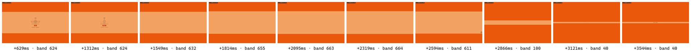
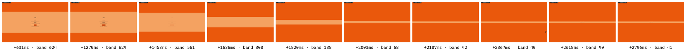
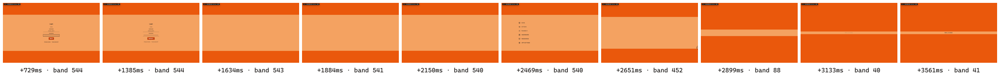
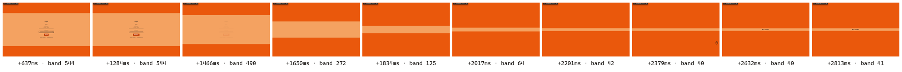
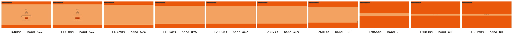
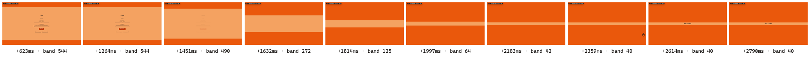
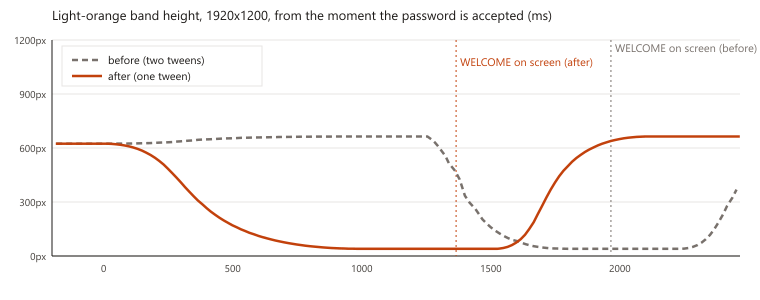
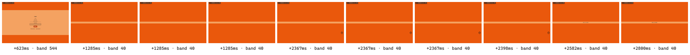

# 59 — SIGN-IN: the welcome goes straight to its size

**What you asked for (2026-10-09).** After the password, the light-orange
band used to widen first and then close down to the WELCOME strip. Now it
only closes: one smooth movement from the size it has around the form to the
thin strip WELCOME sits in.

Written 2026-10-09 against `feat/post-overhaul-edit-versioning` (S6a,
`po/s6a-signin-welcome`). No database change.

## What you will see

1. You press **Sign in** (or **Verify** after your code, or pick a workspace).
   The form fades out.
2. The two orange bars close toward the middle in **one** movement, about one
   second long, until only a thin light-orange strip is left.
3. **WELCOME** fades into that strip, holds, and the bars open onto Home, the
   way every page change works.

Gone:

- **The widening.** On a tall window, more than about 1120 pixels high, the
  band used to grow first. On a 1920x1200 window it grew by 40 pixels, and in
  a window 1380 pixels high (a maximised window on a 2560x1440 screen) by 126.
- **The pause.** At every size the band used to stop for a moment between two
  movements.
- **The flash of Home's list.** Home's page buttons used to show for a split
  second in that pause.

WELCOME now arrives about half a second sooner than before: roughly 1.4
seconds after your password is accepted, instead of 1.9.

Unchanged: the logo and chime, the bars parting to show the form, the
forgot-password screens, the first-sign-in profile screen and the two-factor
setup screen, and every page change inside the app.

## Two things to try

1. **Sign in with the app maximised on your biggest screen.** This is where
   the widening was largest. Watch the band from the moment you press
   **Sign in**. It should only ever get thinner until WELCOME appears.
2. **Turn off Windows animations** (Settings, Accessibility, Visual effects,
   Animation effects off) and sign in again. The bars should jump straight to
   the thin strip with no movement in between, and WELCOME then appears in
   it. Turn the setting back on afterwards if you like it on.

## Before and after

Each strip runs left to right from the sign-in form to WELCOME on screen. The
label under each frame is the time since **Sign in** was pressed and the
band's height in pixels. The pictures are in `docs/sessions/handoffs/img/`.

A tall window, 1920x1200: before, the band grows from 624 to 664 pixels and
pauses before closing.

1440x900, a 14-inch laptop:

1280x700, the smallest window the desktop app allows:

The band's height over time, before (grey, dashed) and after (orange):

With animations off, 1440x900, after: one cut to the strip.

**How these were taken.** A test browser filled in the real sign-in form and
recorded every frame. The sign-in server was simulated inside that browser,
so no real account was used and nothing left the computer.
